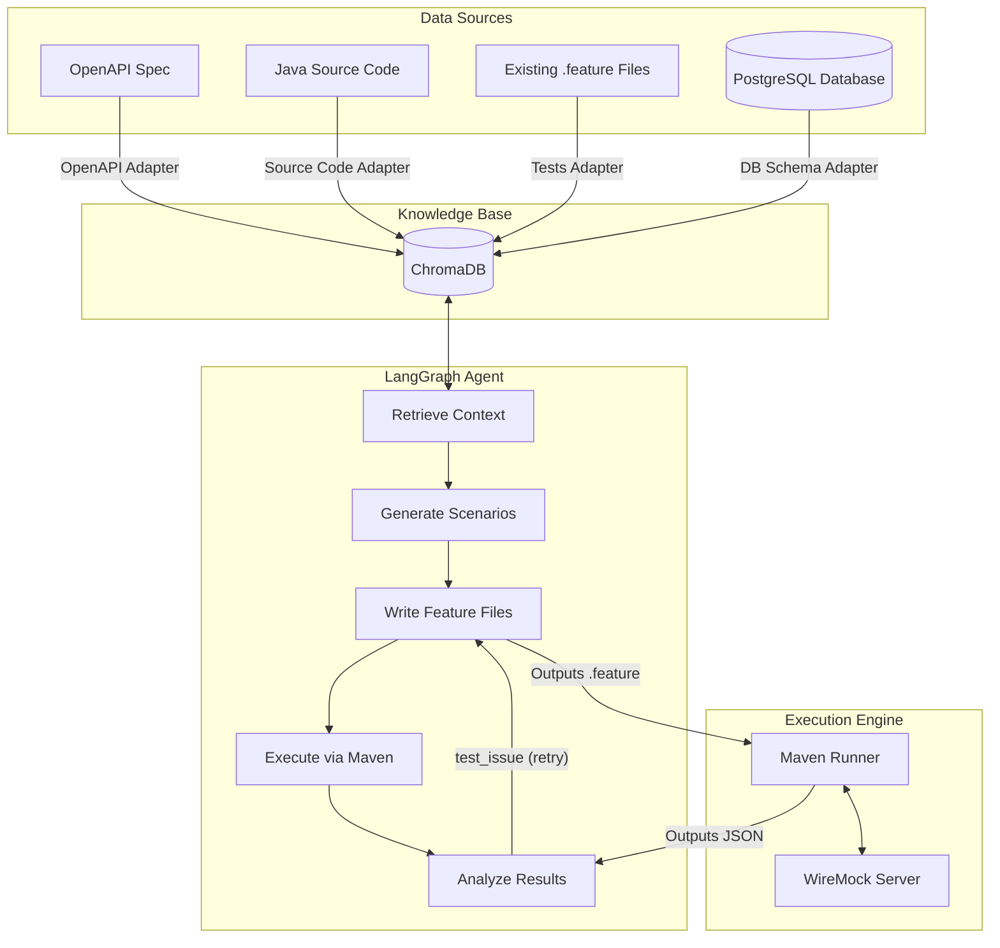
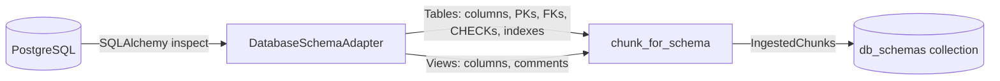
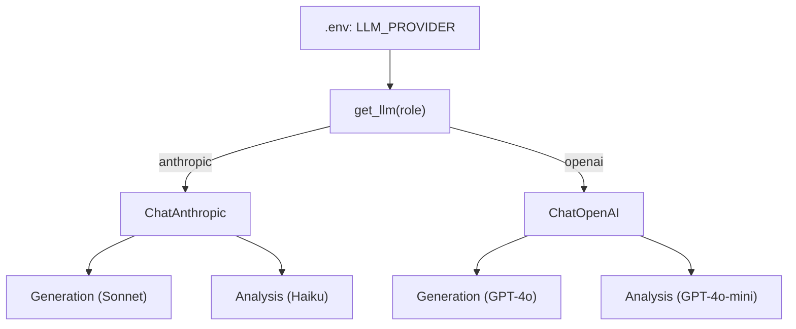

# Architecture Overview: AI Agentic Karate Testing

This document describes the high-level architecture of the Karate AI Agent — a multi-source RAG pipeline that generates schema-aware, JDBC-verified Karate test suites from API specifications, Java source code, existing tests, and PostgreSQL database schemas.

## System Components



## Data Flow

1. **Ingestion**: The `ingest` pipeline reads OpenAPI specs, tree-sitter AST parses Java code, existing `.feature` files, and introspects PostgreSQL database schemas via SQLAlchemy. Each source is chunked and embedded into ChromaDB with metadata tags.
2. **Retrieval**: When a user queries `POST /orders`, the semantic retriever finds the matching spec, `OrderService.java` logic, related existing tests, and database table schemas (columns, constraints, foreign keys).
3. **Generation**: The LLM generates structured `TestScenario` objects based on the cross-referenced context, including schema-derived scenarios (FK violations, CHECK constraint boundaries, NUMERIC overflow) that are invisible to spec-only test generators.
4. **Writing**: The LLM converts the scenarios to valid Karate `.feature` files with **JDBC verification steps** that query the database after API calls to confirm persistence and constraint enforcement.
5. **Execution**: A subprocess triggers Maven to run the tests against a local WireMock server that mimics the target application. JDBC steps run against the PostgreSQL database.
6. **Analysis**: The LLM reads the Karate JSON report and classifies any failures.
7. **Self-Correction**: If a test fails due to bad syntax or a bad assertion, it loops back, updates the feature, and re-executes.

## Knowledge Sources

The pipeline ingests five distinct knowledge sources into separate ChromaDB collections:

| Collection | Adapter | What It Captures |
|------------|---------|-----------------|
| `api_specs` | `OpenAPIAdapter` | Endpoints, parameters, request/response schemas, auth requirements |
| `source_code` | `SourceCodeAdapter` | Java methods, annotations, business logic branches, validation rules (via tree-sitter AST) |
| `existing_tests` | `ExistingTestsAdapter` | Karate scenarios, step patterns, data-driven patterns (CSV/Excel/inline) |
| `karate_reference` | `ExistingTestsAdapter` | Karate DSL syntax examples for style-consistent feature generation |
| `db_schemas` | `DatabaseSchemaAdapter` | Table/view definitions, column types, PKs, FKs, CHECK/UNIQUE constraints, indexes, comments |

### Database Schema Ingestion

The `DatabaseSchemaAdapter` uses SQLAlchemy's `inspect()` API to introspect a live PostgreSQL database:



Each table produces a chunk formatted for LLM readability:

```
Table: orders (schema: public)
Description: Customer orders. Business rule: GOLD tier customers receive 10% discount when total > $500

Columns:
  - id: UUID [PK, NOT NULL, DEFAULT gen_random_uuid()]
  - customer_id: UUID [NOT NULL, FK → customers.id]
  - status: VARCHAR(20) [NOT NULL, DEFAULT 'PENDING']
  - total_amount: NUMERIC(12,2) [NOT NULL]
  - discount_applied: NUMERIC(12,2) [NOT NULL, DEFAULT 0.00]

Check Constraints:
  - orders_total_check: total_amount >= 0
  - orders_discount_check: discount_applied >= 0

Foreign Keys:
  - customer_id → customers.id ON DELETE CASCADE
```

### Schema-Aware Test Generation

With schema context, the LLM generates test categories that are **invisible to spec-only generators**:

| Test Category | Schema Source | Example |
|---------------|-------------|---------|
| FK violation | `orders.customer_id FK → customers.id` | Send non-existent `customerId` → expect 400/404 |
| CHECK boundary | `total_amount NUMERIC(12,2) CHECK >= 0` | Send `totalAmount = 99999999999.99` → expect 400 |
| ENUM validation | `customer_tier ENUM('STANDARD','GOLD','PLATINUM')` | Send `customerTier = "INVALID"` → expect 400 |
| Default verification | `status DEFAULT 'PENDING'` | Omit status in request → verify response has `PENDING` |
| JDBC persistence | Full table schema | After POST, query DB to verify row was persisted correctly |

### JDBC Verification in Generated Features

When schema context is available, the feature writer generates inline Java JDBC steps:

```gherkin
# After a successful POST /orders:
* def conn = java.sql.DriverManager.getConnection(dbUrl, props)
* def stmt = conn.prepareStatement("SELECT status, total_amount FROM orders WHERE id = ?")
* eval stmt.setObject(1, java.util.UUID.fromString(response.id))
* def rs = stmt.executeQuery()
* eval rs.next()
* match rs.getString('status') == 'PENDING'
* match rs.getBigDecimal('total_amount').doubleValue() == 550.0
* eval conn.close()
```

For error scenarios, JDBC steps verify **no write occurred**:
```gherkin
# After a rejected POST (FK violation):
* match rs.getInt('cnt') == 0  # No order persisted
```

## LLM Provider Architecture

The system uses a **factory pattern** for LLM provider agnosticism:



Switching providers requires only a `.env` change — zero code modifications.

## Technology Choices

| Component | Choice | Rationale |
|-----------|--------|-----------|
| LLM Provider | Claude / GPT (configurable) | Provider-agnostic factory supports Anthropic and OpenAI. Strong code understanding, predictable structured JSON output. |
| Orchestration | LangGraph | State-based graph approach enables cyclic loops (self-correction) which linear chains cannot easily handle. |
| Vector DB | ChromaDB | Local, file-backed vector database requires no external infrastructure and supports metadata filtering out-of-the-box. |
| Code Parsing | tree-sitter | Deterministic AST parsing ensures method boundaries are exact, rather than relying on messy regex. |
| DB Introspection | SQLAlchemy | Portable across database engines (PostgreSQL, MySQL, SQLite). `inspect()` API extracts columns, constraints, FKs, indexes without raw SQL. |
| Test Execution | Maven subprocess | Natively runs Karate tests ensuring 100% compatibility with Java test environments and existing CI/CD. |
| Mocking | WireMock | Industry-standard mocking tool that supports JSONPath matching to validate generated HTTP assertions dynamically. |
| Database | PostgreSQL 16 (Docker) | Docker Compose provides a seeded database for schema ingestion and JDBC verification during test execution. |

## Infrastructure

```
karate-automation-project/
├── agents/                  # LangGraph nodes (scenario_generator, feature_writer, result_analyzer)
│   └── prompts/             # System/user prompt templates with schema context injection
├── cli/                     # Typer CLI (ingest, ingest-schema, generate, execute, stats, metrics)
├── config/                  # Settings + LLM factory (get_llm)
├── data/                    # Sample specs, source code, features, syntax examples
├── db/                      # init.sql — PostgreSQL seed schema (customers, orders, order_items)
├── docs/                    # Architecture, setup guide, demo script
├── executor/                # Maven runner + WireMock automation
├── ingestion/               # Adapters (OpenAPI, SourceCode, ExistingTests, DatabaseSchema)
├── karate_project/          # Maven project with generated .feature files
├── rag/                     # ChromaDB vector store, embeddings, retriever, reranker, chunking
├── tests/                   # 48 unit tests
├── docker-compose.yml       # PostgreSQL 16 container (port 5434)
└── .env                     # Provider keys, DB connection, model config
```
