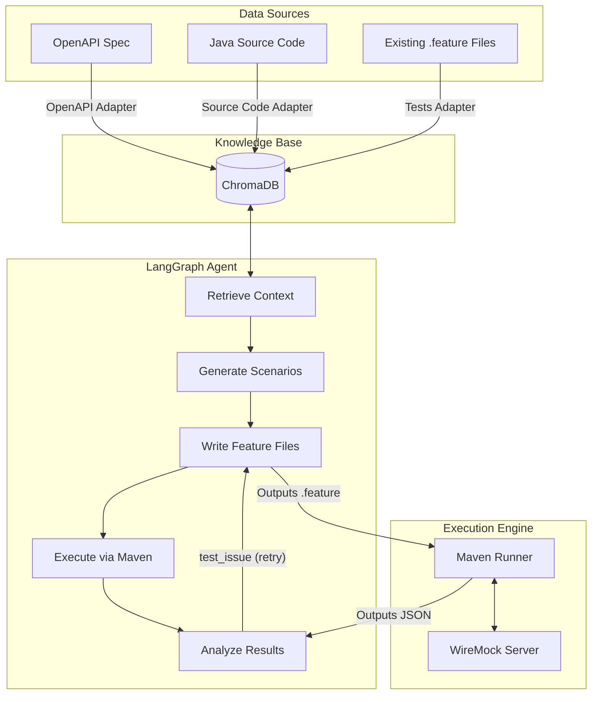

# Architecture Overview: AI Agentic Karate Testing

This document describes the high-level architecture of the Karate AI Agent.

## System Components

## Data Flow

1. **Ingestion**: The `ingest` pipeline reads OpenAPI specs, tree-sitter AST parses Java code, and existing `.feature` files. It chunks them into ChromaDB with metadata tags.
2. **Retrieval**: When a user queries `POST /orders`, the semantic retriever finds the matching spec, `OrderService.java` logic, and related existing tests.
3. **Generation**: Claude Sonnet generates structured `TestScenario` objects based on the cross-referenced context, explicitly highlighting business rules.
4. **Writing**: Claude converts the scenarios to valid Karate `.feature` files, using retrieved syntax examples to avoid hallucinations.
5. **Execution**: A subprocess triggers Maven to run the tests against a local WireMock server that mimics the target application.
6. **Analysis**: Claude Haiku reads the Karate JSON report and classifies any failures.
7. **Self-Correction**: If a test fails due to bad syntax or a bad assertion, it loops back, updates the feature, and re-executes.

## Technology Choices

| Component | Choice | Rationale |
|-----------|--------|-----------|
| LLM Provider | Claude API (Anthropic) | Strong code understanding, predictable structured JSON output, excellent reasoning over complex business logic. |
| Orchestration | LangGraph | State-based graph approach enables cyclic loops (self-correction) which linear chains (LangChain) cannot easily handle. |
| Vector DB | ChromaDB | Local, file-backed vector database requires no external infrastructure and supports metadata filtering out-of-the-box. |
| Code Parsing | tree-sitter | Deterministic AST parsing (used by GitHub Copilot) ensures method boundaries are exact, rather than relying on messy regex. |
| Test Execution | Maven subprocess | Natively runs Karate tests ensuring 100% compatibility with Java test environments and existing CI/CD. |
| Mocking | WireMock | Industry-standard mocking tool that supports JSONPath matching to validate generated HTTP assertions dynamically. |
